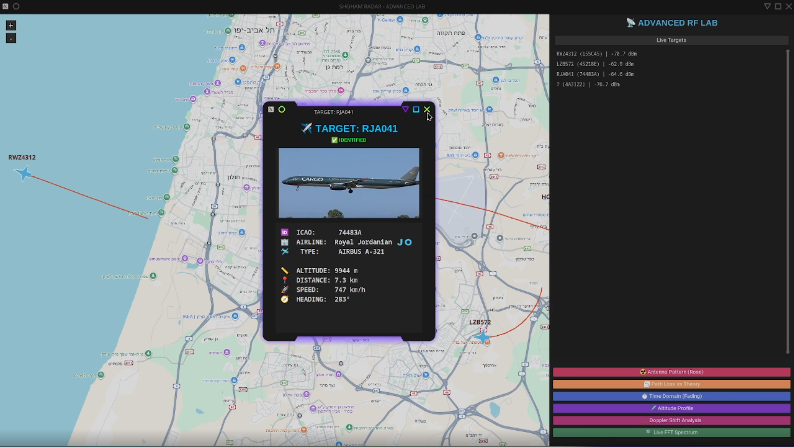
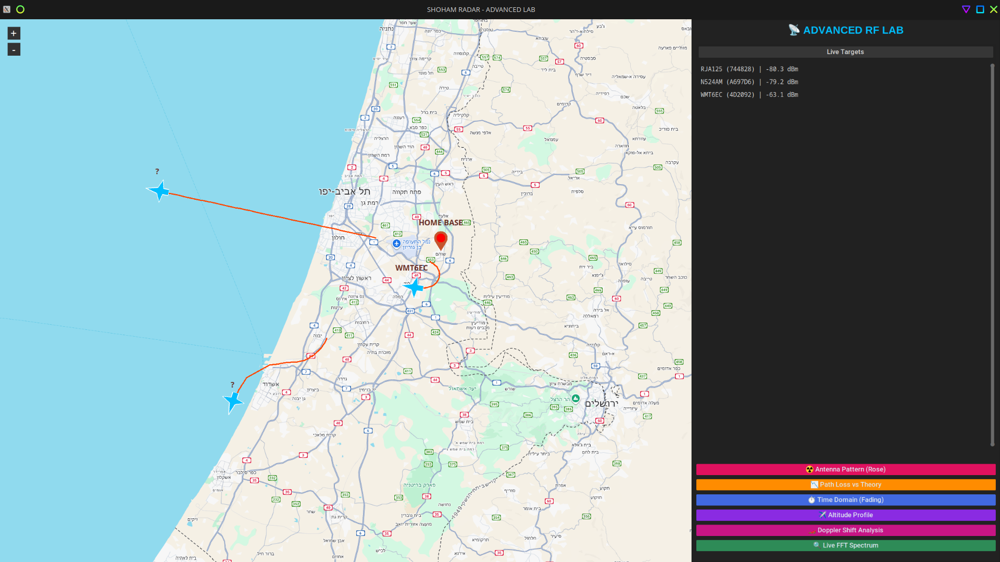

# adsb_radar

A from-scratch ADS-B receiver built in pure Python with an RTL-SDR — from raw I/Q samples all the way to live aircraft on a map.



## What is this?

A real-time ADS-B receiver that decodes aircraft transmissions on 1090 MHz without dump1090 or any external decoding libraries. The entire receiver chain — signal detection, demodulation, message decoding, CRC validation, and position decoding — is implemented from scratch in Python to understand the RF physical layer and the Mode-S / ADS-B protocol end to end.

Aircraft are displayed live on a map with their callsign, altitude, speed and heading, and are cross-referenced against online databases for airline and aircraft type.

## How it works

```
RTL-SDR (1090 MHz, 2 MSPS) → Signal Conditioning → Burst Detection
   → PPM Demodulation → Mode-S CRC Check → ADS-B (DF17) Decode
   → CPR Position Decode → UDP → Live Map + Target List
```

**RF front end:** RTL-SDR sampling the 1090 MHz band at 2 MSPS. A hand-built and soldered 1090 MHz antenna, checked with a nanoVNA. Mounting the antenna high (clear line of sight) gave a reception range of roughly 30 km with accurate positions.

**Signal processing (`CORE.py`):**
- **Signal conditioning:** magnitude from raw I/Q, dynamic noise-floor estimate
- **Burst detection:** adaptive threshold (mean × factor) to find candidate preambles
- **PPM demodulation:** each bit is decided by comparing the two half-slots of its 1 µs window (energy in the first half = 1, second half = 0)
- **CRC validation:** manual bitwise implementation of the Mode-S 24-bit CRC to reject corrupted frames
- **Message decoding:** ADS-B messages (Mode-S Downlink Format 17) — callsign, altitude, and velocity/heading are decoded from the ME field by type code
- **Position:** CPR (Compact Position Reporting) decoding to resolve latitude/longitude

**Display (`MAIN.py`):**
- Tactical map with aircraft icons, heading rotation, and flight trails
- Live target list with callsign, altitude, distance, speed and heading
- Aircraft identification (airline / type / photo) via online lookups by ICAO hex


*Coverage over central Israel — several aircraft tracked simultaneously with their flight trails, HOME BASE marked in Shoham.*

## A note on scope

This decodes **ADS-B specifically** — that is, Mode-S **DF17** messages — and validates them with the Mode-S CRC. It does not decode the other Mode-S downlink formats (interrogation replies, Comm-B, etc.); those frames are filtered out. The goal was to build and understand the ADS-B chain end to end, not a full Mode-S stack.

## Two RF lessons from building this

**LNA saturation near the airport.** Living about 5 km from Ben Gurion, my first instinct on getting zero data was to push the gain up to ~49.6 dB. That was the mistake — the front end saturated on the airport's strong transmitters and drowned real aircraft in the noise floor. Dropping the gain to ~35 dB stabilized reception and aircraft appeared immediately. More gain is not more reception.

**RF says there's a signal; DSP says whether you understood it.** With a clean FFT peak at 1090 MHz and a working antenna, I was still decoding nothing. The bug was in pulse detection — short one-to-two-sample pulses were being merged into 15–20 sample blocks, which broke the preamble and frame structure so the decoder could never lock. Fixing the pulse-detection logic and tuning the threshold was what made messages start decoding. Same SDR, same antenna, same signal — the difference was in the processing.

## Hardware

- RTL-SDR (Blog V3/V4) + hand-built 1090 MHz antenna
- nanoVNA (used to check the antenna's response)
- *(A 1090 MHz LNA + filter was later purchased to extend range, but the antenna had already been taken down due to weather before it could be tested.)*

## Installation & Setup

### Prerequisites

```bash
sudo apt install librtlsdr-dev
```

### Clone & install

```bash
git clone https://github.com/Nir552/adsb_radar.git
cd adsb_radar

python3 -m venv venv
source venv/bin/activate

pip install -r requirements.txt
```

### Configure your location

Open `CORE.py` and `MAIN.py` and set your receiver's reference position:

```python
REF_LAT = 32.000
REF_LON = 34.000
```

### Run

```bash
python3 launcher.py
```

## Project Structure

| File | Description |
|------|-------------|
| `CORE.py` | DSP backend: I/Q capture, burst detection, PPM demod, CRC, ADS-B + CPR decode |
| `MAIN.py` | GUI frontend: map, target list, aircraft identification |
| `launcher.py` | Starts backend + GUI |
| `requirements.txt` | Dependencies |

## License

Educational & research use.

## Author

Nir Sabbah
